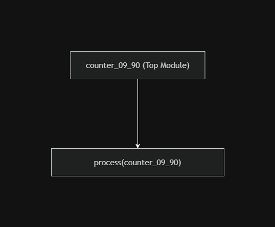
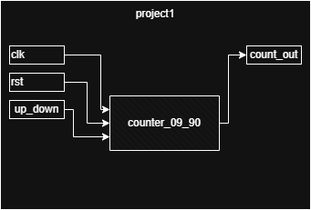
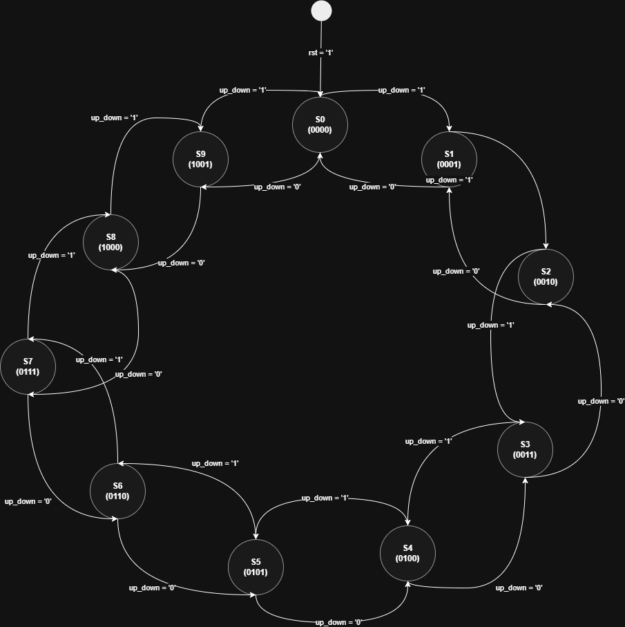
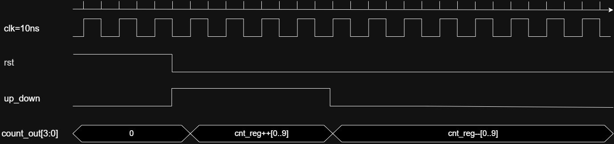
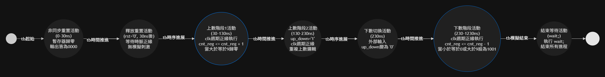

# Project 1: Configurable 0-9 Up/Down Counter (基礎雙向循環計數器系統)

## 項目簡介 (Project Description)
本項目為 FPGA 數位電路設計之 **Project 1：設計一個可動態切換正向/反向的 4-bit 循環計數器**。

系統核心功能圍繞於單一高效能計數器單元，透過外部控制引腳 `up_down` 進行即時硬體行為調度：當切換為上數時，系統於 `0` 至 `9` 區間做非對稱邊界循環；切換為下數時，則自動逆向由 `9` 倒數至 `0`。另外，本設計導入了非同步重置與防禦性電路設計，確保系統在實際 FPGA 晶片上運作時，具備極高的抗干擾能力與穩健性。

---

## 1. 系統架構與模組階層 (System Architecture)

本項目採用模組化硬體描述語言進行建構，將輸入控制端、暫存器核心與輸出解譯電路完整解耦。以下為本系統的架構拆解圖：

### 模組階層樹狀圖 (Module Hierarchy)

### 系統方塊圖與 RTL 電路圖 (Block Diagram)
下圖為系統的實體輸入/輸出（I/O）與內部暫存器走線結構。系統藉由單一進程（Process）實現時脈同步觸發，並透過內部暫存器的並行指派，將數據動態呈現於 4-bit 寬度的 `count_out` 埠。

---

## 2. 有限狀態機設計 (Finite State Machine, FSM)

為了完美表現 `0` 至 `9` 的循環跳轉特性，硬體內部控制邏輯可映射為一個具備 10 個合法狀態的環形有限狀態機（FSM）。

* **雙向跳轉機制**：當 `up_down = '1'` 時，狀態沿順時針方向遞增（S0 ➔ S1 ➔ ... ➔ S9）；當 `up_down = '0'` 時，則沿逆時針方向遞減。
* **自動歸繞（Wrap-around）**：在上數極限（S9）與下數極限（S0）處，系統會依據控制訊號自動跳回對應端點。
* **防禦性狀態修正**：若系統在實體環境中不幸掉入無效狀態（如 `1010` 至 `1111` 等未定義區間），硬體組合邏輯將會強制將其拉回合法電路範圍。

---

## 3. 時序規格藍圖 (Timing Specifications)

在時脈週期定義為 10ns (100MHz) 的環境下，下圖規劃了系統預期的理想切換行為。這份時序藍圖定義了重置訊號釋放後，計數器隨 `up_down` 訊號上下變更時，資料線（`count_out`）理想上的時脈正緣（Rising Edge）同步跳變特性。

---

## 4. 測試平台與模擬行為流程 (Testbench & Simulation Flow)

為驗證硬體邏輯與極限邊界的正確性，測試平台（`tb_counter_09_90.vhd`）規劃了完整的生命週期驗證。下圖為該行為在時間軸上的運作節點（Activity-on-Node, AoV）：

### 測試平台核心激勵步驟
1. **重置驗證**：初始階段將 `rst` 拉高穩定維持 30ns（共 3 個時脈週期），以驗證非同步重置（Asynchronous Reset）功能。
2. **長週期功能觀測**：釋放重置後，將 `up_down` 設為 `'1'` 進行全程上數測試，連續維持 1000ns 以完整觀察暫存器多輪循環的波形。

---

## 5. 繞線後時序延遲分析 (Post-Routing Timing Analysis)

本項目完整比對了 **Behavioral Simulation（功能模擬）** 與 **Post-Implementation Simulation（實體佈線後時序模擬）**，成功觀測到真實數位電路中的物理特性。

### 軟體模擬 vs. 繞線後模擬

透過 Vivado 模擬波形的精確比對，可以清晰看出兩者的決定性差異：

| 評比項目 | Behavioral Simulation (功能模擬) | Post-Implementation Timing (佈線後時序模擬) |
| :--- | :--- | :--- |
| **延遲模型** | **零延遲 (Zero Delay)** 訊號變化與時脈正緣完美同步切換。 | **真實走線延遲 (Propagation Delay)** 包含硬體邏輯閘延遲與金屬導線延遲。 |
| **切換點觀測** | 如游標鎖定的 **225.000ns** 處，當時脈上升沿觸發，`count_out` 瞬間從 `9` 跳變為 `0`。 | 時脈上升後，`count_out` 必須經歷一段實體傳播延遲，數值波形才會發生轉變。 |
| **訊號初始狀態** | 模擬初始的前 30ns 內，重置訊號拉高，輸出直接呈現乾淨、無干擾的固定值 `0`。 | 在開機前數奈秒（ns），由於暫存器內部硬體電路尚未就緒且存在初始建立時間，輸出端會伴隨短暫的不確定態。 |

---

## 6. 模擬環境與運行指引 (How to Run)

1. 將主程式 `counter_09_90.vhd` 加入至 Xilinx Vivado 專案的 **Design Sources** 中。
2. 將測試平台 `tb_counter_09_90.vhd` 加入至 **Simulation Sources** 中。
3. 於 Vivado 左側選單執行 **Run Simulation -> Run Behavioral Simulation** 驗證 0-9 理想循環功能（對齊 Section 3 的時序規格藍圖）。
4. 點擊 **Run Simulation -> Run Post-Implementation Timing Simulation** 觀察實體電路繞線後的真實硬體時序與走線延遲。
