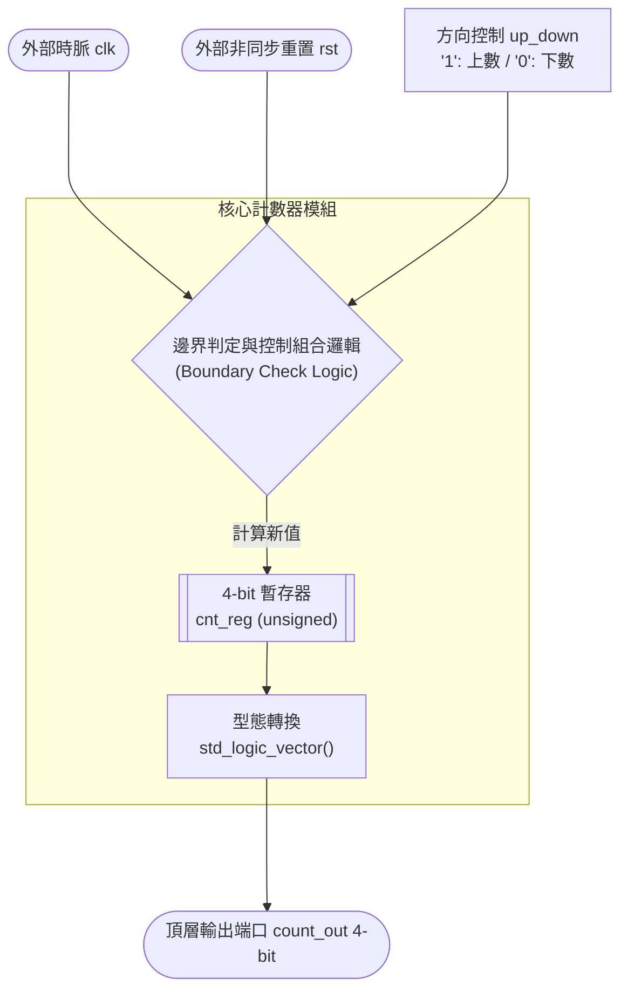

# Project 1: Configurable 0-9 Up/Down Counter (基礎雙向循環計數器系統)

## 項目簡介 (Project Description)

本項目為 FPGA 數位電路設計之 **Project 1：設計一個可動態切換正向/反向的 4-bit 循環計數器**。

系統核心功能圍繞於單一高效能計數器單元，透過外部控制引腳 `up_down` 進行即時硬體行為調度：當切換為上數時，系統於 `0` 至 `9` 區間做非對稱邊界循環；切換為下數時，則自動逆向由 `9` 倒數至 `0`。另外，本設計導入了非同步重置與防禦性電路設計，確保系統在實際 FPGA 晶片上運作時，具備極高的抗干擾能力與穩健性。

---
## Project 1 系統架構方塊圖
```markdown

```
---

## 硬體架構圖 (Block Diagram)



---

## 模組設計說明與程式碼解析 (Module Specifications)

### 1. 主程式核心邏輯 (`counter_09_90.vhd`)

* **I/O 埠界面宣告**：
對外定義 4-bit 寬度的 `count_out` 輸出端點，滿足十進制最高數值 `9`（二進制 `1001`）的硬體定址需求。
* **內部動態運算（暫存器）**：
由於 VHDL 的 `std_logic_vector` 不支援直接進行數學運算，本設計於內部宣告無號數暫存器 `cnt_reg`（`unsigned(3 downto 0)`），並透過並行指派機制將其即時轉換至輸出埠。
* **雙向循環判定邏輯**：
* **非同步重置 (Asynchronous Reset)**：當 `rst = '1'` 時，電路無視時脈狀態，立即強制將暫存器歸零（`0000`）。
* **正向上數 (`up_down = '1'`)**：採自動邊界判定，數值抵達上限 `9` 時，下一個時脈正緣觸發 Wrap-around（歸繞）回到 `0`。
* **反向下數 (`up_down = '0'`)**：當遞減至 `0` 時，下一個時脈正緣自動跳回頂點 `9`。同時加入防禦性設計（`or cnt_reg > 9`），若不幸掉入無效狀態（`10` 至 `15`），硬體將能自動修正跳回合法區間。


### 2. 測試平台驗證 (`tb_counter_09_90.vhd`)

* **硬體時脈環境模擬**：產生週期為 10ns（頻率 100MHz）的系統主時脈。
* **激勵流程調度**：
1. 初始階段將 `rst` 拉高 30ns（維持 3 個時脈週期），以驗證非同步重置功能。
2. 釋放重置後，將 `up_down` 設為 `'1'` 進行全程上數測試，連續維持 1000ns 以完整觀察暫存器多輪循環的波形。


---

## 繞線後時序延遲分析 (Post-Routing Timing Analysis)

本項目完整比對了 **Behavioral Simulation（功能模擬）** 與 **Post-Implementation Simulation（實體佈線後時序模擬）**，成功觀測到真實數位電路中的物理特性。

### 理想世界（功能模擬）vs. 真實物理（時序模擬）

透過 Vivado 模擬波形的精確比對（如圖所示），可以清晰看出兩者的決定性差異：

| 評比項目 | Behavioral Simulation (功能模擬) `[對應理想波形圖]` | Post-Implementation Timing (佈線後時序模擬) `[對應真實波形圖]` |
| --- | --- | --- |
| **延遲模型** | **零延遲 (Zero Delay)**訊號變化與時脈正緣完美切換。 | **真實走線延遲 (Propagation Delay)**包含硬體邏輯閘延遲與金屬導線延遲。 |
| **切換點觀測** | 如游標鎖定的 **225.000ns** 處，當時脈上升沿觸發，`count_out` 瞬間從 `9` 跳變為 `0`。 | 如實體波形圖所示，時脈上升後，`count_out` 必須經歷一段實體傳播延遲，數值波形才會發生轉變。 |
| **訊號初始狀態** | 模擬初始的前 30ns 內，重置訊號拉高，輸出直接呈現乾淨、無干擾的固定值 `0`。 | 在開機前數奈秒（ns），由於暫存器內部硬體電路尚未就緒且存在初始建立時間，輸出端會伴隨短暫的不確定態。 |

```
【時序模擬中物理延遲公式】
真實輸出變更時間 = 時脈正緣觸發點 + Tco (Clock-to-Output Delay) + Trouting (線路延遲)

```

> **專業技術結論**：雖然在佈線後時序模擬（`Post-Implementation Simulation`）中觀測到了訊號落後於時脈沿的物理偏斜（Skew），但其延遲時間遠小於時脈週期 10ns。輸出訊號切換過程極為平穩，無任何不合法毛邊（Glitch），充分證明此計數器結構在 100MHz 實體時脈環境下具備極高的時序餘裕（Timing Slack）與硬體穩定度。

---

## 模擬環境與運行指引 (How to Run)

1. 將主程式 `counter_09_90.vhd` 加入至 Xilinx Vivado 專案的 **Design Sources** 中。
2. 將測試平台 `tb_counter_09_90.vhd` 加入至 **Simulation Sources** 中。
3. 於 Vivado 左側選單執行 **Run Simulation -> Run Behavioral Simulation** 驗證 0-9 理想循環功能。
4. 點擊 **Run Simulation -> Run Post-Implementation Timing Simulation** 觀察實體電路繞線後的真實硬體時序與走線延遲。
